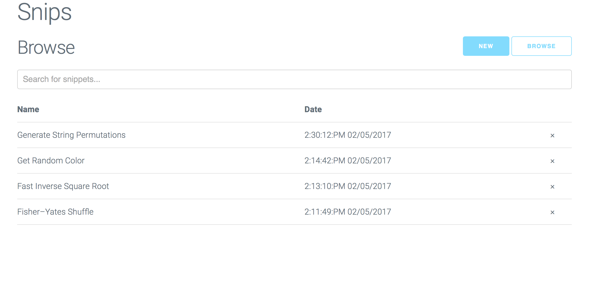
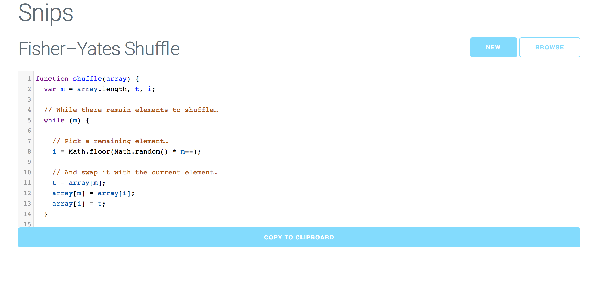

# Snips: #
An online text editor with a focus on code and speed.




## Summary ##
Snips saves your code while offering fast copy-paste, live searching, and simple organization.

## Features ##
* Syntax highlighting
* One-click copy and pasting
* Live-search

## Reviews ##
> Snips gives me a great a way to store all those random bits of code and hauls from Stack Overflow.

— Some Guy

> Live-searching rocks! Snips can find any of my snippets easily, keeping my project files neat and tidy. 

— Some Gal

## Getting Started ##
From the root directory, run:

```

npm install
cd public
bower install
cd ..
node server.js

```

Then visit localhost:8000 in any browser. 
